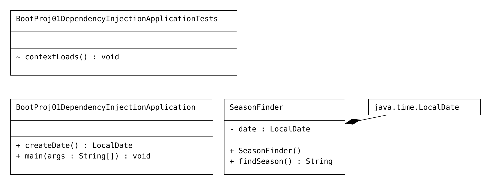

# BootProj01DependencyInjection
 
#Code

```Java

package com.session.sbeans;

import java.time.LocalDate;

import org.springframework.beans.factory.annotation.Autowired;
import org.springframework.stereotype.Component;

@Component("sf")
public class SeasonFinder {
	@Autowired
	private LocalDate date;

	public SeasonFinder() {
		System.out.println("SeasonFinder:: 0-param constructor");
	}

	// b.method
	public String findSeason() {
		System.out.println("SeasonFinder.findSeason()");
		// get current month value
		int monthValue = date.getMonthValue();
		// write b.logic
		if (monthValue >= 3 && monthValue <= 6)
			return "Summer Season";
		else if (monthValue >= 7 && monthValue <= 10)
			return "Rainy Season";
		else
			return "Winter Season";
	}

}
package com.session;

import java.time.LocalDate;

import org.springframework.boot.SpringApplication;
import org.springframework.boot.autoconfigure.SpringBootApplication;
import org.springframework.context.ApplicationContext;
import org.springframework.context.ConfigurableApplicationContext;
import org.springframework.context.annotation.Bean;

import com.session.sbeans.SeasonFinder;

@SpringBootApplication

public class BootProj01DependencyInjectionApplication {

    @Bean(name = "dt")
    public LocalDate createDate() {
        System.out.println("BootProj01DependencyInjectionApplication.createDate()");
        return LocalDate.now();
    }

    public static void main(String[] args) {
        // get IOC cointainer
        ApplicationContext ctx = SpringApplication.run(BootProj01DependencyInjectionApplication.class, args);
        // get Spring bean class obj ref (Target)
        SeasonFinder finder = ctx.getBean("sf", SeasonFinder.class);
        // invoke the b.method
        String resultMsg = finder.findSeason();
        System.out.println("output is " + resultMsg);

        // close container
        ((ConfigurableApplicationContext) ctx).close();
    }

}
```

# Logs
```log
SeasonFinder:: 0-param constructor
BootProj01DependencyInjectionApplication.createDate()
SeasonFinder.findSeason()
output is Summer Season
```

# UML
